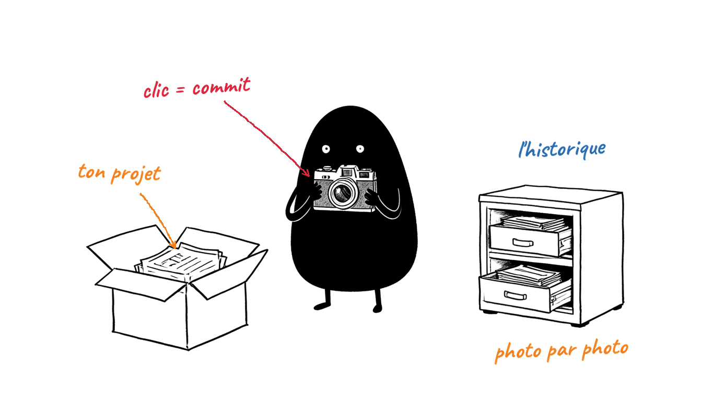
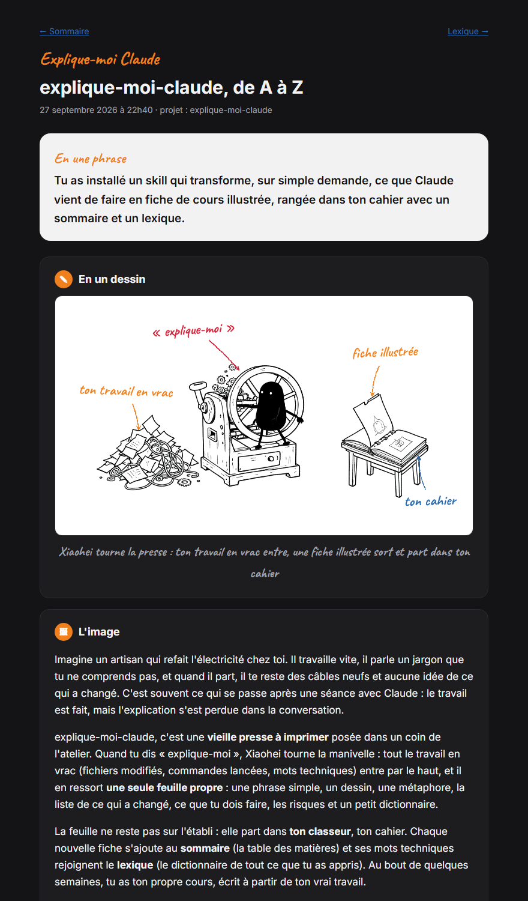

# explique-moi-claude

Un skill pour [Claude Code](https://claude.com/claude-code) qui explique le travail technique à quelqu'un qui n'est pas développeur.

Tu dis **« explique-moi »**, et Claude transforme ce qu'il vient de faire en une **fiche de cours** HTML. La fiche contient une phrase simple, un **dessin** du personnage Xiaohei, une métaphore de la vie réelle, tous les changements (avant → maintenant → pourquoi), ce que tu dois faire, les risques dits franchement et un lexique. Les fiches s'accumulent dans ton cahier, avec un sommaire et un lexique cumulé.



> **Claude Code uniquement** : terminal, extension VS Code ou onglet « Code » de Claude Desktop. Le skill ne fonctionne pas dans claude.ai, dans l'onglet Chat de Claude Desktop ni dans Cowork. Il a besoin de ton disque et de Python, et il refuse poliment de s'y lancer.

## Utilisation

| Tu dis | Tu obtiens |
|---|---|
| « explique-moi » / « explique-moi ce que tu viens de faire » | une fiche sur le travail qui vient d'être fait, avec son dessin |
| « explique-moi le machine learning » | une fiche sur ce sujet |
| « dessine-moi ce que tu viens de faire » | uniquement le dessin |
| `/explique-moi-claude` | une fiche, en commande |

Rien ne se déclenche tout seul : pas de fiche ni de dessin sans demande.

## Exemple

Une vraie fiche produite par le skill, sur le skill lui-même : « explique-moi ce que fait explique-moi-claude, de A à Z ».

[](examples/fiche-recap/cahier/fiches/2026-09-27-2240-explique-moi-claude-de-a-a-z.html)

- La fiche complète : [`examples/fiche-recap/cahier/fiches/2026-09-27-2240-explique-moi-claude-de-a-a-z.html`](examples/fiche-recap/cahier/fiches/2026-09-27-2240-explique-moi-claude-de-a-a-z.html)
- Le cahier qui va avec : le [sommaire](examples/fiche-recap/cahier/index.html) et le [lexique](examples/fiche-recap/cahier/lexique.html)
- Ce que Claude écrit avant la mise en page : [`fiche.json`](examples/fiche-recap/fiche.json), et le [dessin](examples/fiche-recap/dessin.png)

GitHub montre le code des pages HTML au lieu de les afficher. Pour voir la fiche en vrai, ouvre-la sur GitHub, clique sur « Download raw file », puis ouvre le fichier dans ton navigateur : il contient déjà son dessin.

## Installation

### La plus simple : demande à ton IA

Dans Claude Code, colle ce message :

> Installe explique-moi-claude depuis https://github.com/OskySF/explique-moi-claude en suivant la section « Instructions pour l'IA » de son README.

### À la main

Prérequis : Claude Code, Git, Python 3 avec Pillow (`python -m pip install pillow`) et un compte Cloudflare gratuit (pour les dessins).

```bash
git clone https://github.com/OskySF/explique-moi-claude.git "$HOME/.claude/skills/explique-moi-claude"
```

(La même ligne marche dans PowerShell, sous Windows.)

Ouvre ensuite ton fichier de réglages :

```bash
python "$HOME/.claude/skills/explique-moi-claude/scripts/fiche.py" --config "$HOME/.claude/skills/explique-moi-claude/config.json" --init
```

Il s'ouvre dans l'éditeur de texte. Remplis-le, puis enregistre :

- `dossier_cours` : où ranger tes fiches (par défaut `Documents/Explique-moi Claude`) ;
- `cloudflare.account_id` : l'identifiant de ton compte, dans le tableau de bord Cloudflare ;
- `cloudflare.api_token` : Mon profil → Jetons API → créer un jeton avec la permission « Workers AI ».

Tu colles toi-même la clé dans le fichier : elle ne passe jamais par la conversation. Le fichier s'appelle `config.json`, dans le dossier du skill (`~/.claude/skills/explique-moi-claude/`). Il n'est jamais publié et il est conservé lors des mises à jour. Si tu sautes cette étape, Claude ouvre le fichier à la première utilisation.

Tape enfin `/explique-moi-claude` ou dis « explique-moi ». Si la commande n'apparaît pas, tape `/reload-skills` ou redémarre Claude Code.

- Mettre à jour : `git -C "$HOME/.claude/skills/explique-moi-claude" pull`
- Désinstaller : supprimer le dossier `~/.claude/skills/explique-moi-claude` (ta clé part avec lui ; tes fiches restent dans ton cahier).

## Instructions pour l'IA

Si tu es une IA à qui l'on demande d'installer (ou de mettre à jour) explique-moi-claude :

1. **Vérifie que tu es Claude Code** (CLI, Cursor, VS Code ou onglet Code de Claude Desktop). Sinon, n'installe rien. Explique à l'utilisateur que ce skill ne fonctionne que dans Claude Code, et ne propose **pas** de l'ajouter à claude.ai, au Chat ou à Cowork.
2. Vérifie Python 3 et Pillow (`python -c "import PIL"`). Si Pillow manque, propose `python -m pip install pillow`.
3. Le dossier d'installation est `~/.claude/skills/explique-moi-claude` (dans le dossier personnel de l'utilisateur ; sous Windows, `C:\Users\<nom>\.claude\skills\explique-moi-claude`). Note si `~/.claude/skills` existe déjà.
   - S'il contient déjà `SKILL.md`, c'est une mise à jour : `git -C "$HOME/.claude/skills/explique-moi-claude" pull`.
   - Sinon : `git clone https://github.com/OskySF/explique-moi-claude.git "$HOME/.claude/skills/explique-moi-claude"`.
   - Sans Git : télécharge https://github.com/OskySF/explique-moi-claude/archive/refs/heads/main.zip et copie le contenu de son dossier `explique-moi-claude-main/` dans le dossier d'installation.
4. Vérifie que `~/.claude/skills/explique-moi-claude/SKILL.md` existe.
5. **Configure maintenant** : lance `python "$HOME/.claude/skills/explique-moi-claude/scripts/fiche.py" --config "$HOME/.claude/skills/explique-moi-claude/config.json" --init`. Le fichier de réglages s'ouvre dans l'éditeur de texte de l'utilisateur. Explique-lui les trois champs : `dossier_cours` (où ranger ses fiches, par défaut `Documents/Explique-moi Claude`), `cloudflare.account_id` (tableau de bord Cloudflare) et `cloudflare.api_token` (Mon profil → Jetons API → créer un jeton avec la permission « Workers AI »). Il les remplit **lui-même** puis enregistre. Ne demande jamais la clé dans la conversation et n'affiche jamais le contenu du fichier. S'il n'a pas encore de compte Cloudflare, il peut remplir le fichier plus tard : Claude le rouvrira à la première utilisation.
6. Dis à l'utilisateur de taper `/explique-moi-claude` ou de dire « explique-moi ». Claude Code détecte le nouveau skill sans redémarrage, sauf si `~/.claude/skills` n'existait pas avant l'étape 3 : dans ce cas, il doit taper `/reload-skills` (ou redémarrer Claude Code).

## Ce qu'il y a dans le cahier

```
<dossier des cours>/
├─ index.html        sommaire des fiches (avec vignettes)
├─ lexique.html      tous les mots appris, de A à Z, avec recherche
├─ donnees.json      mémoire du cahier (liste des fiches + lexique)
└─ fiches/
   ├─ 2026-09-25-1430-mettre-son-projet-sous-git.html
   └─ images/        les dessins
```

Chaque fiche contient son dessin : on peut l'envoyer ou la déplacer seule sans rien casser.

## Structure du dépôt

Le dépôt est le skill lui-même : on le clone directement dans `~/.claude/skills/`.

```
SKILL.md              la commande /explique-moi-claude : ce que Claude doit faire
DESSIN.md             le mode d'emploi du dessin (pour la fiche, ou seul avec « dessine-moi »)
scripts/fiche.py      crée la fiche, le sommaire et le lexique
scripts/dessin.py     génère le dessin (Cloudflare) et pose les étiquettes
fonts/                la police Caveat des étiquettes
examples/             fiche-recap/ : une fiche complète (JSON, dessin, cahier généré, aperçu) ;
                      fiche-exemple.json + dessin-exemple.png : un exemple plus court
config.example.json   modèle du fichier de réglages
```

## Limites

- Quota gratuit de Cloudflare : environ 10 000 « neurons » par jour, soit à peu près 60 dessins. Il se recharge chaque jour à minuit UTC. Si le quota est épuisé, la fiche est quand même créée, avec la mention « Dessin indisponible ».
- Les polices Caveat et Inter des fiches viennent de Google Fonts : sans connexion, la fiche s'affiche avec une police système.

## Confidentialité

Ta clé Cloudflare reste dans ton `config.json`, que le `.gitignore` exclut : un `git pull` ne le touche pas et il n'est jamais publié. Le `.gitignore` exclut aussi les dossiers de données personnelles. Si une clé est publiée par erreur, révoque-la tout de suite dans Cloudflare : la retirer du dépôt ne suffit pas.

## Crédits

- Personnage et style Xiaohei : [ian-xiaohei-illustrations](https://github.com/helloianneo/ian-xiaohei-illustrations) de Ian (MIT).
- Police Caveat : SIL Open Font License 1.1.
- Code de ce dépôt : MIT, voir [LICENSE](LICENSE).
